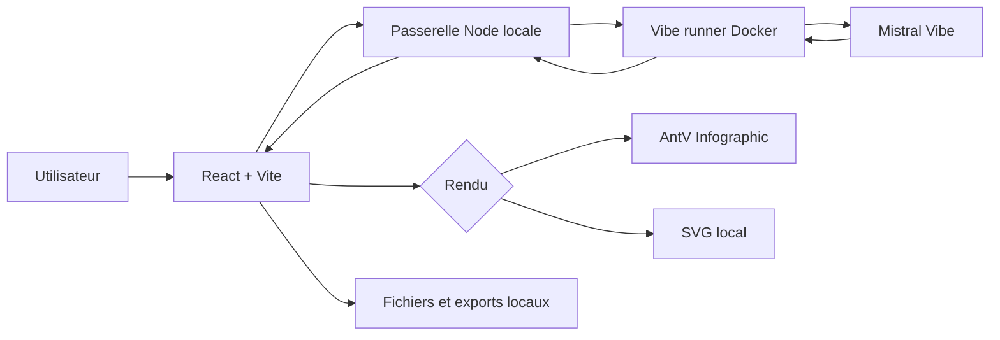
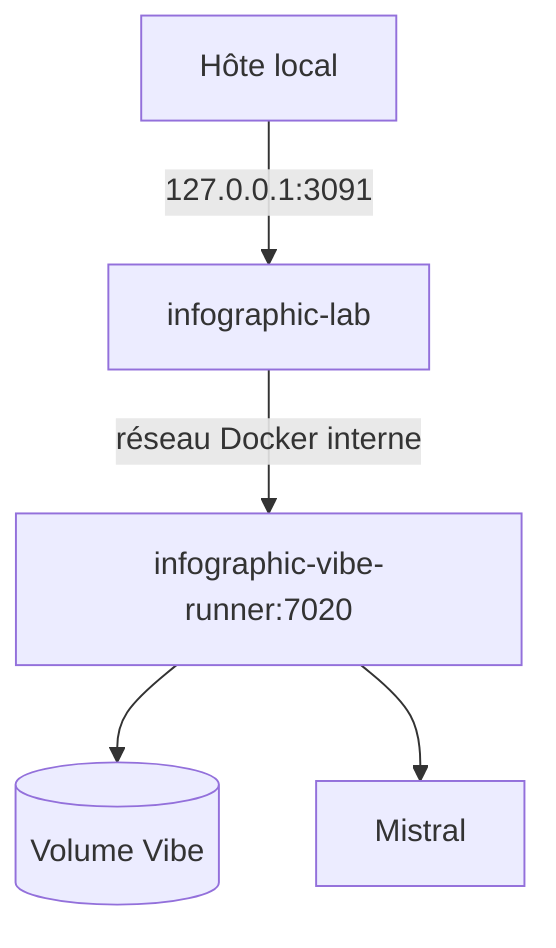

# Architecture

## Baseline

Infographic Lab **1.0.0** est une application locale distribuée avec Docker Compose.

- interface : React + Vite ;
- passerelle locale : Node.js ;
- structuration IA : Mistral Vibe dans un runner Docker dédié ;
- rendu : AntV Infographic ou moteur SVG local ;
- stockage : fichiers JSON et exports locaux ;
- base de données : aucune.

## Vue simple



## Conteneurs



Le port `7020` du runner n'est pas publié sur l'hôte. La communication entre l'application et le runner utilise un token interne.

## Organisation

- `src` : interface et logique frontend ;
- `server.mjs` : passerelle Node locale ;
- `runners/vibe` : runner Mistral Vibe ;
- `docker-compose.yml` : orchestration locale ;
- `Dockerfile` : image de l'application ;
- `.github/workflows` : CI, Release GitHub et publication Docker Hub ;
- `docs/images` : visuels de documentation.

## Distribution

Les images officielles sont publiées sur Docker Hub pour `linux/amd64` et `linux/arm64` :

```text
erwanntorrent/infographic-lab:1.0.0
erwanntorrent/infographic-vibe-runner:1.0.0
```

Le fichier `docker-compose.yml` consomme directement ces images publiées.
