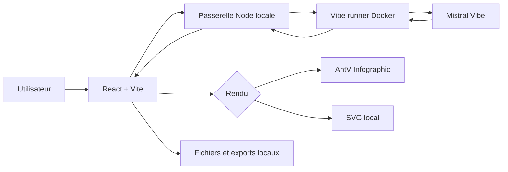
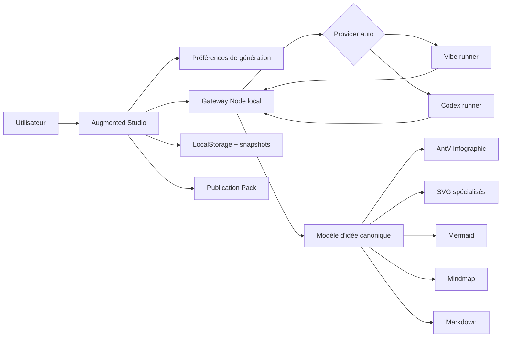

# Architecture

## Deux lignes de produit

Le dépôt conserve deux états clairement séparés :

- `main` : **Infographic Lab 1.0.0**, version stable publique sur le port 3091 ;
- `feature/infographic-lab-augmented` : préversion Augmented sur le port 3092.

Visual Campaign Studio n'appartient plus au périmètre Augmented. Son chantier est isolé sur `feature/visual-campaign-studio`.

## Architecture stable 1.0.0

- interface : React + Vite ;
- passerelle locale : Node.js ;
- structuration IA : Mistral Vibe dans un runner Docker dédié ;
- rendu : AntV Infographic ou moteur SVG local ;
- stockage : projets et exports locaux ;
- base de données : aucune.



## Architecture Augmented

La préversion étend le cœur **structure → représentation** sans introduire de SaaS obligatoire.



### Modèle canonique

Le modèle reste rétrocompatible avec les projets existants. Un item conserve `title` et `description` et peut désormais porter, de façon optionnelle :

- `value` : valeur numérique explicitement présente dans la source ;
- `unit` : unité associée ;
- `category` : catégorie ;
- `series` : série.

Ces champs servent aux graphiques de données et aux KPI. Ils ne doivent jamais être inventés pour compléter artificiellement une série.

L'apparence peut aussi mémoriser :

- orientation `auto`, `portrait`, `landscape` ou `square` ;
- visuel cible demandé par l'utilisateur.

### Moteurs de rendu

- **AntV Infographic** : processus, timelines, comparaisons, listes, pyramides, entonnoirs, cartes et variantes standard ;
- **SVG local spécialisé** : Iceberg, Cycle, Sankey narratif, Matrix, SWOT, Impact/Effort, Eisenhower, Risk Matrix, Architecture, Hub, Hiérarchie, Venn, Table, KPI et graphiques chiffrés ;
- **Mermaid.js** : diagrammes ;
- **Mindmap** : représentation structurée du même modèle ;
- **react-markdown + GFM** : document Markdown.

## Préférences de génération

Les préférences sont locales au navigateur et guident la structuration :

- visuel cible ;
- orientation ;
- niveau `Synthétique / Équilibré / Détaillé` ;
- reformulation libre ou conservation du wording source.

Le provider ne produit pas le SVG. Il produit toujours un modèle JSON validé par la passerelle.

## Conteneurs Augmented

Le compose Augmented ajoute le runner Codex au runner Vibe. Les runners restent sur le réseau Docker interne et utilisent des tokens partagés distincts ou hérités de `RUNNER_SHARED_TOKEN`.

Le navigateur ne reçoit aucun secret de provider.

## Organisation du dépôt

- `src` : interface, modèle, validation et moteurs de représentation ;
- `server.mjs` : gateway locale, validation et routage multi-provider ;
- `runners/vibe` : runner Vibe ;
- `runners/codex` : runner Codex ;
- `docker-compose.yml` : stable 1.0.0 ;
- `docker-compose.augmented.yml` : préversion Augmented ;
- `.github/workflows` : validation CI et chaîne de release ;
- `docs/images` : visuels de documentation.

## Distribution

La stable 1.0.0 reste distribuée avec :

```text
erwanntorrent/infographic-lab:1.0.0
erwanntorrent/infographic-vibe-runner:1.0.0
```

L'image Augmented ne doit pas être republiée tant que la préversion n'est pas explicitement validée.
