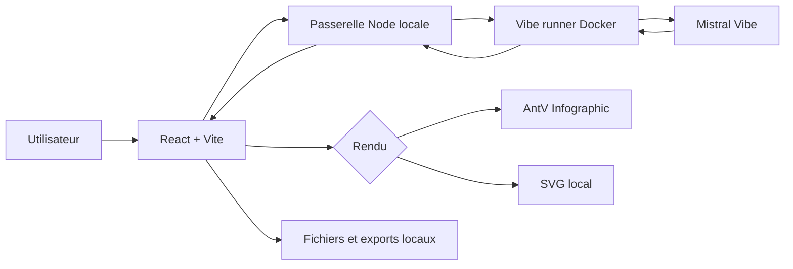

# Architecture

## Deux parcours dans `main`

Le dépôt conserve deux parcours clairement séparés :

- **Stable 1.0.0** : version publique historique sur le port `3091` ;
- **Augmented V2** : préversion intégrée dans `main`, sur le port `3092`.

La fusion d'Augmented dans `main` ne remplace pas automatiquement la stable 1.0.0. Les deux configurations Docker restent séparées.

Visual Campaign Studio n'appartient pas au périmètre Augmented. Son chantier reste isolé sur `feature/visual-campaign-studio`.

## Architecture stable 1.0.0

- interface : React + Vite ;
- passerelle locale : Node.js ;
- structuration IA : Mistral Vibe dans un runner Docker dédié ;
- rendu : AntV Infographic ou moteur SVG local ;
- stockage : projets et exports locaux ;
- base de données : aucune.



## Architecture Augmented V2

Augmented étend le cœur **structure → représentation** sans introduire de SaaS obligatoire.


### Modèle canonique

Un item conserve `title` et `description` et peut porter de façon optionnelle :

- `value` ;
- `unit` ;
- `category` ;
- `series`.

Ces champs servent aux graphiques de données et aux KPI. Ils ne doivent jamais être inventés pour compléter une série.

L'apparence peut mémoriser l'orientation `auto`, `portrait`, `landscape` ou `square` ainsi qu'un visuel cible.

### Moteurs de rendu

- **AntV Infographic** : processus, timelines, comparaisons, listes, pyramides, entonnoirs, cartes ;
- **SVG local spécialisé** : Iceberg, Cycle, Sankey narratif, Matrix, SWOT, Impact/Effort, Eisenhower, Risk Matrix, Architecture, Hub, Hiérarchie, Venn, Table, KPI et graphiques chiffrés ;
- **Mermaid.js** : diagrammes ;
- **Mindmap** : représentation structurée ;
- **react-markdown + GFM** : document Markdown.

## Préférences de génération

Les préférences sont locales au navigateur : visuel cible, orientation, niveau de détail et proximité avec le wording source.

Le provider ne produit jamais directement le SVG : il produit un modèle JSON validé par la passerelle.

## Conteneurs

- `docker-compose.yml` : Stable 1.0.0 ;
- `docker-compose.augmented.yml` : Augmented V2 ;
- runners Vibe/Codex sur réseau Docker interne ;
- secrets providers jamais transmis au navigateur.

## Organisation du dépôt

- `src` : interface, modèle, validation et moteurs de représentation ;
- `server.mjs` : gateway locale, validation et routage ;
- `runners/vibe` : runner Vibe ;
- `runners/codex` : runner Codex ;
- `.github/workflows` : CI et release ;
- `docs/images` : visuels de documentation.

## Distribution

Stable 1.0.0 reste distribuée avec :

```text
erwanntorrent/infographic-lab:1.0.0
erwanntorrent/infographic-vibe-runner:1.0.0
```

Augmented est intégré au code principal mais ne doit pas être présenté comme remplacement automatique de la stable ni republié comme image de production sans validation explicite.
