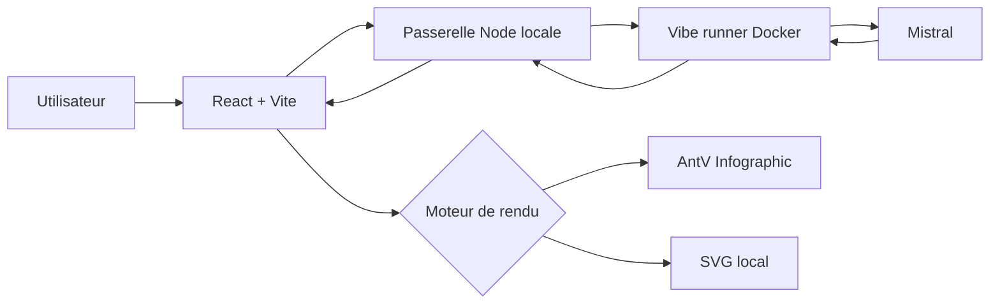

# Infographic Lab 1.0.0

Infographic Lab transforme un texte en infographie éditable dans une application locale. Mistral Vibe structure le contenu en JSON canonique ; AntV Infographic et un moteur SVG local produisent les visuels. L'utilisateur peut ensuite modifier le contenu, le style, les pictogrammes, la structure et les exports sans relancer l'IA.

[Voir la vitrine](https://etorrent-org.github.io/infographic-lab/) · [Télécharger la dernière Release](https://github.com/Etorrent-Org/infographic-lab/releases/latest)

<p align="center">
  
</p>

## Vue d'ensemble

Le workflow garde une séparation claire entre IA et rendu : Vibe structure le texte en JSON contrôlé, la passerelle locale valide cette structure, puis AntV ou le moteur SVG local construit le visuel. L'utilisateur peut ensuite éditer, sauvegarder et exporter sans nouvel appel IA, sauf s'il demande explicitement une retouche Vibe ciblée.

## Préversion Augmented

Le développement post-1.0.0 se poursuit sur `feature/infographic-lab-augmented`, sans modifier la stable `main` tant que la préversion n'est pas validée.

La direction retenue est **structure → représentation**, dans un esprit « Napkin light » local-first : un même modèle d'idée alimente Infographie, Mermaid, Mindmap et Markdown.

La préversion ajoute notamment :

- gateway Vibe / Codex avec mode Automatique ;
- bibliothèque locale, snapshots, Brand Kit, Quality Gate et Publication Pack ;
- préférences de génération : visuel cible, orientation, niveau de détail et proximité avec le wording source ;
- représentations business supplémentaires : Matrix, SWOT, Impact / Effort, Eisenhower, Risk Matrix, Architecture, Hub, Hiérarchie, Venn et Table visuelle ;
- KPI et graphiques Barres, Colonnes, Courbe, Donut et Waterfall chiffré ;
- métadonnées numériques optionnelles et rétrocompatibles dans le modèle canonique ;
- garde-fou explicite : aucune valeur n'est inventée pour compléter artificiellement un graphique.

Visual Campaign Studio a été extrait de cette préversion et évolue séparément sur `feature/visual-campaign-studio`.

Consultez [`README_AUGMENTED.md`](README_AUGMENTED.md) et [`AUGMENTED_SCOPE.md`](AUGMENTED_SCOPE.md) pour le périmètre en cours.

## Fonctionnalités 1.0.0

- génération depuis un texte avec les types `Auto`, `Processus`, `Comparaison`, `Timeline` et `Liste` ;
- styles `Clean`, `Soft`, `Dark`, `Sketch` et `Chalk` ;
- variantes AntV avec garde-fous pour les contenus trop longs ;
- rendus SVG locaux `Iceberg`, `Cycle` et `Sankey simple` ;
- templates prêts à l'emploi et 16 pictogrammes locaux ;
- édition du titre, du sous-titre et de chaque bloc ;
- ajout, suppression et réordonnancement des blocs ;
- retouche Vibe ciblée d'un seul bloc avec avant/après et annulation locale ;
- sauvegarde de projets JSON v2 ;
- exports SVG, PNG et HTML autonome.

## Prérequis 1.0.0

- Windows 10/11 avec PowerShell pour le script d'installation fourni ;
- Docker Desktop avec `docker compose`, ou un autre hôte Docker Compose compatible ;
- un accès Mistral Vibe configuré : soit une clé API Mistral pour une première installation, soit un profil Vibe existant dans le volume Docker utilisé.

Infographic Lab 1.0.0 utilise Mistral Vibe `2.21.0`, version validée avec cette V1.

## Images Docker Hub

Les images officielles de la V1 sont publiées sur Docker Hub en `linux/amd64` et `linux/arm64` :

```text
erwanntorrent/infographic-lab:1.0.0
erwanntorrent/infographic-vibe-runner:1.0.0
```

Le `docker-compose.yml` de la branche `main` utilise ces images publiées directement. Aucun build local n'est nécessaire pour cette installation.

L'image Augmented reste une préversion et ne doit pas être considérée comme stable avant validation explicite.

## Installation rapide avec Docker Hub

1. Récupérez la branche `main` du dépôt, soit avec **Code → Download ZIP** sur GitHub, soit avec Git :

```powershell
git clone https://github.com/Etorrent-Org/infographic-lab.git
cd infographic-lab
```

2. Pour une première installation sans profil Vibe existant, créez votre configuration locale :

```powershell
Copy-Item .env.example .env
notepad .env
```

3. Dans ce cas, renseignez votre clé :

```text
MISTRAL_API_KEY=votre_cle
```

Si vous réutilisez un volume `VIBE_HOME_VOLUME` contenant déjà un profil Vibe configuré, `MISTRAL_API_KEY` peut rester vide.

4. Téléchargez les images Docker Hub et démarrez l'application :

```powershell
.\START-INFOGRAPHIC-LAB.ps1
```

5. Ouvrez `http://127.0.0.1:3091`.

Pour les lancements suivants, utilisez la même commande.

> La Release GitHub `v1.0.0` a été publiée avant la bascule vers le parcours Docker Hub décrit dans la branche `main`. Les notes de Release historiques restent inchangées.

### Docker Compose direct

```bash
docker compose pull
docker compose up -d
```

Par défaut, le Compose utilise le tag `1.0.0`. Vous pouvez sélectionner explicitement un autre tag publié avec `INFOGRAPHIC_LAB_IMAGE_TAG`.

## Architecture



La préversion Augmented ajoute un runner Codex et plusieurs représentations du même modèle. Voir [`ARCHITECTURE.md`](ARCHITECTURE.md).

## Configuration stable

`.env.example` contient uniquement des valeurs d'exemple. Le fichier `.env` est ignoré par Git.

Variables principales :

```text
MISTRAL_API_KEY=
INFOGRAPHIC_LAB_IMAGE_TAG=1.0.0
VIBE_HOME_VOLUME=infographic-lab_vibe_home
RUNNER_SHARED_TOKEN=
```

Si `RUNNER_SHARED_TOKEN` n'est pas fourni, le script PowerShell génère un token interne au lancement.

## Développement

```powershell
npm install
npm run build
```

Pour vérifier également la préversion Augmented :

```powershell
docker compose config --quiet
docker compose -f docker-compose.augmented.yml config --quiet
```

Pour arrêter la stack stable :

```powershell
docker compose down
```

N'utilisez pas `docker compose down -v` si vous souhaitez conserver le profil Vibe stocké dans le volume Docker.

## Sécurité

- publication réseau stable limitée à `127.0.0.1:3091` ;
- runners sur le réseau Docker interne ;
- tokens internes entre application et runners ;
- réponses IA validées avant rendu ;
- pas de Docker socket ;
- pas de base de données serveur ;
- pas de secret versionné.

Voir [`SECURITY.md`](SECURITY.md).

## Limites de la V1

- le Sankey est narratif : l'épaisseur des flux n'encode pas une mesure quantitative ;
- pas de collaboration temps réel ni de bibliothèque serveur de projets ;
- la qualité factuelle dépend du texte source ;
- l'utilisation de Mistral Vibe nécessite un accès Mistral valide et peut être facturée selon le compte.

## Documentation

- [README_AUGMENTED.md](README_AUGMENTED.md)
- [AUGMENTED_SCOPE.md](AUGMENTED_SCOPE.md)
- [ARCHITECTURE.md](ARCHITECTURE.md)
- [ROADMAP.md](ROADMAP.md)
- [CHANGELOG.md](CHANGELOG.md)
- [RELEASE_NOTES_1.0.0.md](RELEASE_NOTES_1.0.0.md)
- [THIRD_PARTY.md](THIRD_PARTY.md)

## Licence

Infographic Lab est distribué sous licence MIT. Consultez [LICENSE](LICENSE).

Le dépôt `Etorrent-Org/infographic-lab` est la distribution publique destinée au téléchargement, aux tests et au développement d'Infographic Lab.
