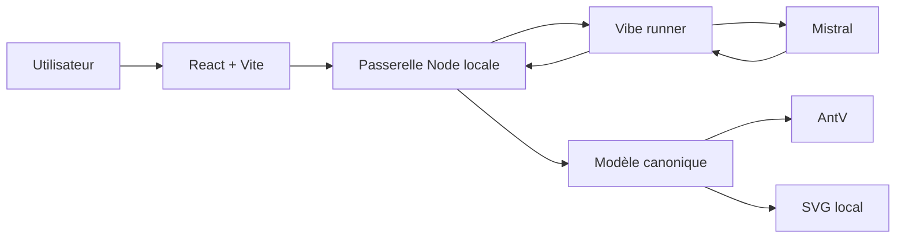
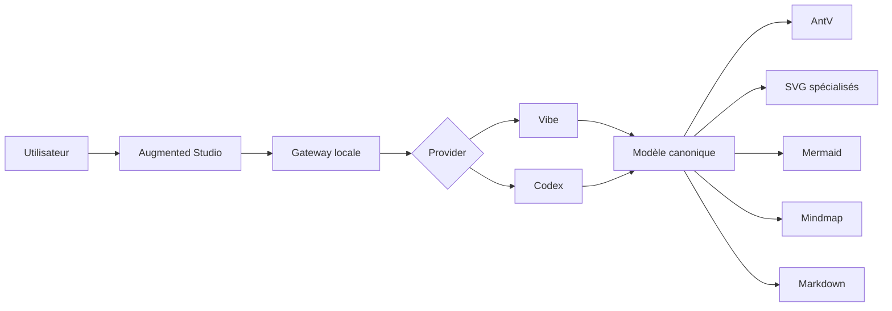

# Infographic Lab

Infographic Lab est une application locale orientée **structure → représentation** : un texte ou une idée est transformé en modèle canonique, puis représenté sous plusieurs formes sans repartir de zéro.

[Voir la vitrine](https://etorrent-org.github.io/infographic-lab/) · [Voir le dépôt](https://github.com/Etorrent-Org/infographic-lab)

## État du dépôt

Le dépôt contient désormais deux parcours clairement séparés :

- **Stable 1.0.0** : runtime historique sur le port `3091`, basé sur Mistral Vibe, AntV Infographic et le moteur SVG local ;
- **Augmented V2** : préversion intégrée au dépôt principal, sur le port `3092`, avec gateway multi-provider Vibe / Codex, catalogue étendu de représentations et contrôles visuels renforcés.

La fusion d'Augmented V2 dans `main` ne remplace pas automatiquement la stable 1.0.0 : les deux configurations Docker restent séparées.

Visual Campaign Studio reste un chantier distinct et n'appartient pas au périmètre Augmented.

## Stable 1.0.0

Fonctions principales :

- structuration d'un texte en JSON canonique ;
- rendus AntV et SVG locaux ;
- types Processus, Comparaison, Timeline, Liste, Iceberg, Cycle et Sankey narratif ;
- édition locale du contenu et du style ;
- sauvegarde des projets ;
- exports SVG, PNG et HTML autonome.

Démarrage :

```powershell
.\START-INFOGRAPHIC-LAB.ps1
```

Puis ouvrir :

```text
http://127.0.0.1:3091
```

Images Docker Hub validées pour la V1 :

```text
erwanntorrent/infographic-lab:1.0.0
erwanntorrent/infographic-vibe-runner:1.0.0
```

## Augmented V2

Augmented étend le même modèle d'idée vers plusieurs représentations :

- Infographie ;
- Mermaid ;
- Mindmap ;
- Markdown.

Le catalogue comprend notamment :

- Iceberg ;
- Cycle ;
- Sankey narratif ;
- Matrice 2×2 ;
- SWOT ;
- Impact / Effort ;
- Eisenhower ;
- Matrice de risque ;
- Architecture en couches ;
- Hub / radial ;
- Hiérarchie / arbre ;
- Venn ;
- Table visuelle ;
- KPI ;
- Barres, Colonnes, Courbe, Donut et Waterfall.

Les graphiques chiffrés ne sont proposés que lorsque les valeurs sont explicitement présentes dans la source. Aucune valeur absente n'est inventée pour compléter une série.

Démarrage Augmented :

```powershell
docker compose -f docker-compose.augmented.yml up -d --build
```

Port par défaut :

```text
http://127.0.0.1:3092
```

## Validation

La préversion Augmented a été soumise à une passe de validation comprenant :

- 297 tests structurels et d'intégrité ;
- 19 familles de rendus custom testées en plusieurs orientations ;
- 20 gabarits AntV contrôlés ;
- 116 rendus Chromium ;
- contrôles SVG et PNG ;
- validation des deux Docker Compose ;
- compilation des runners Vibe et Codex.

La CI associée à la fusion Augmented était verte avant intégration dans `main`.

## Architecture

### Stable



### Augmented



## Sécurité

- services publiés uniquement en local par défaut ;
- runners sur réseau Docker interne ;
- aucun secret provider exposé au navigateur ;
- réponses IA validées avant rendu ;
- `.env` non versionné ;
- pas de Docker socket.

Voir [`SECURITY.md`](SECURITY.md).

## Documentation

- [`README_AUGMENTED.md`](README_AUGMENTED.md)
- [`AUGMENTED_SCOPE.md`](AUGMENTED_SCOPE.md)
- [`ARCHITECTURE.md`](ARCHITECTURE.md)
- [`ROADMAP.md`](ROADMAP.md)
- [`CHANGELOG.md`](CHANGELOG.md)
- [`RELEASE_NOTES_1.0.0.md`](RELEASE_NOTES_1.0.0.md)
- [`THIRD_PARTY.md`](THIRD_PARTY.md)

## Licence

Infographic Lab est distribué sous licence MIT. Consultez [`LICENSE`](LICENSE).
